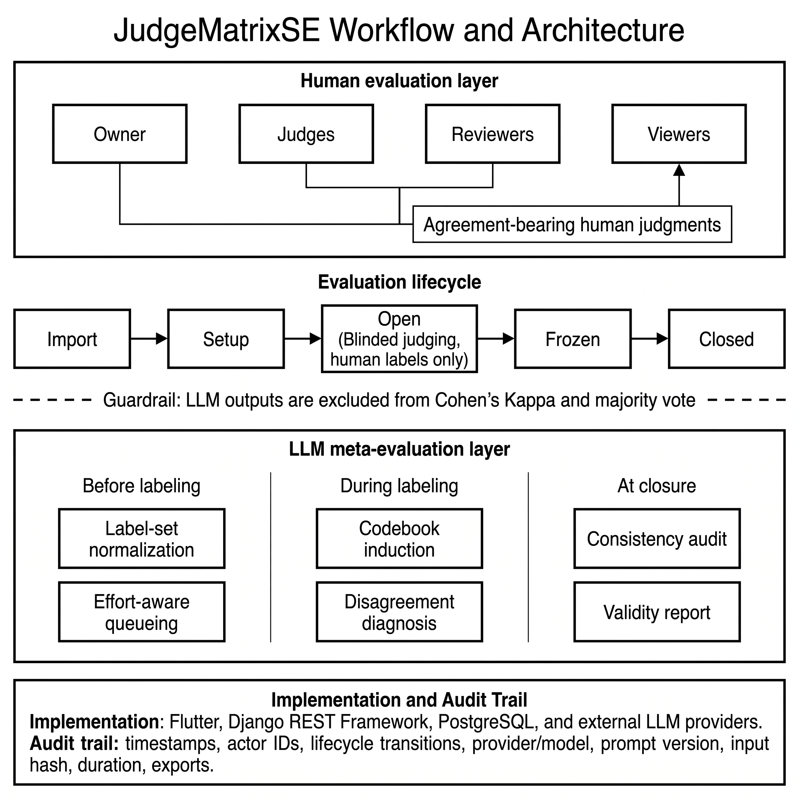

<p align="center">
  
</p>

<p align="center">
  <!-- Repo -->
  <a href="https://github.com/joselitojunior94/Judge-MatrixSE/">
    
  </a>
  <a href="https://github.com/joselitojunior94/Judge-MatrixSE/fork">
    
  </a>
  <a href="https://github.com/joselitojunior94/Judge-MatrixSE/issues">
    
  </a>
  <a href="https://github.com/joselitojunior94/Judge-MatrixSE/pulls">
    
  </a>
  <br/>
  <!-- Stack -->
  
  
  
  
  <br/>
  <!-- CI/CD (exemplos) -->
  
  
</p>


## 🎬 Video and the tool demo

[](https://youtu.be/7uFKmjv2sNg)
[](https://judgematrixse.netlify.app/)


## ✨ What is this?
**JudgeMatrixSE** is a full-stack tool to orchestrate human assessments over structured data (CSV).  
It enables researchers, developers, and teams to **upload datasets, invite collaborators, and collect judgments/reviews** — with automatic agreement metrics like **Cohen’s κ**.

### 🔑 Why it matters?
- 📊 **General-purpose**: works with *any* tabular dataset (issues, CI/CD logs, vulnerability reports, papers, surveys, etc).  
- 👥 **Collaboration**: multiple roles — Owner, Judge, Reviewer, Viewer.  
- ⚡ **Automation**: integrates with LLMs to pre-label or suggest judgments.  
- 📈 **Metrics**: compute inter-rater reliability to validate results.  
- 📤 **Export**: get clean CSV/JSON for research or production pipelines.

## 🏗️ Architecture

<p align="center">
  
</p>

## 🚀 Quickstart

### For Offline use

#### Run the back-end

```bash
git clone https://github.com/joselitojunior94/Judge-MatrixSE.git

cd api

python -m venv .venv
source .venv/bin/activate   # Windows: .venv\Scripts\activate
pip install -r requirements.txt

cd judge_matrixse_api
python manage.py migrate
python manage.py seed_tutorial    
python manage.py createsuperuser
python manage.py runserver

```

#### Run the front-end

```bash
cd ../../front-end/judge_matrixse_app
flutter pub get

# set your backend URL in kApiBaseUrl
flutter run -d chrome

flutter build web

```

## ⚙️ Features

 - 📂 Upload & Merge CSVs
 - 🧩 Column Mapping Wizard
 - 👤 User Roles (Owner, Judge, Reviewer, Viewer)
 - 📝 Judgment & Review Workflows
 - 🤖 Optional LLM Automation
 - 📊 Reliability Metrics (Cohen’s κ)
 - 📤 Export to CSV/JSON

## 🧪 Example Use Cases
 - 🐞 GitHub Issue Labeling (defects, enhancements, questions)
 - 🔐 CI/CD Vulnerability Reports (severity triage)
 - 📚 Paper Classification (systematic mapping)
 - 🧑‍🏫 Educational Data (grading / rubric-based evaluation)

## 📊 REST API (endpoints)

 - POST /api/auth/register/                  # create user
 - POST /api/datasets/upload-csv/            # upload dataset
 - POST /api/datasets/{id}/versions/{v}/mapping/   # save mapping
 - POST /api/evaluations/                    # create evaluation
 - POST /api/evaluations/{id}/items/{iid}/judgments/
 - POST /api/evaluations/{id}/items/{iid}/reviews/
 - GET  /api/evaluations/{id}/metrics/       # Cohen's κ
 - GET  /api/evaluations/{id}/export/csv/    # export results

## 🌟 Citation

